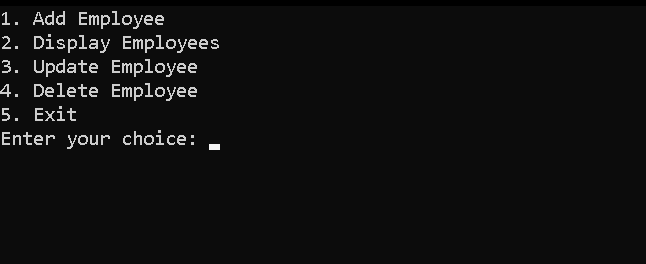
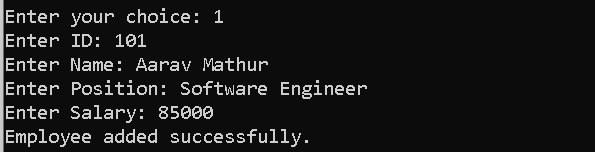
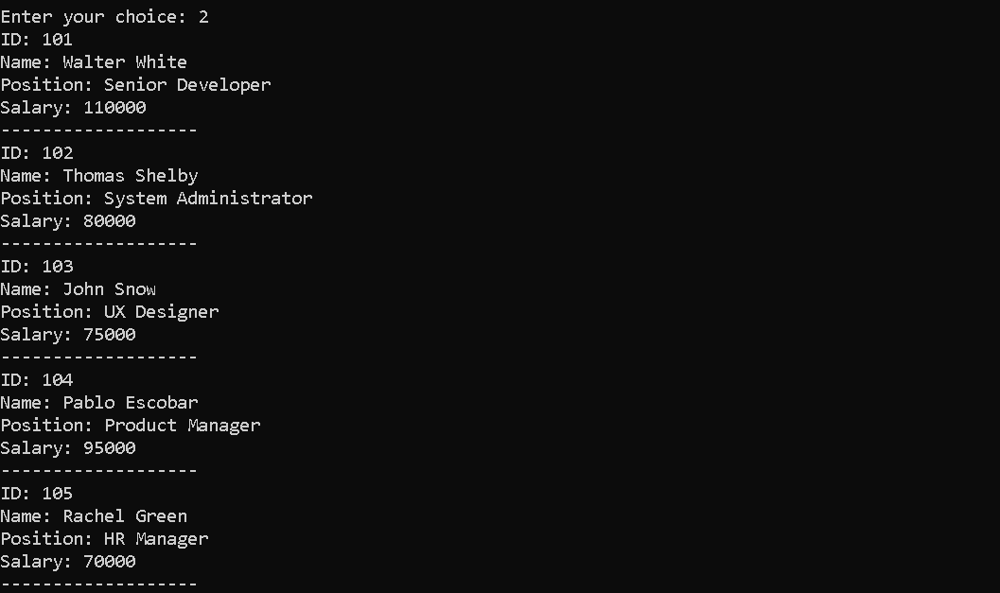
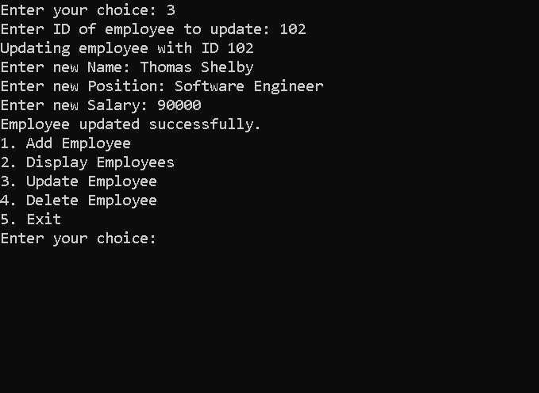

<div align="center">

<h1>🏢 CoManage</h1>

<p><strong>Company Employee Management System — Built with C++ & OOP</strong></p>

<p>
  
  
  
  
  
</p>

<p>A clean, console-based <strong>Employee Management System</strong> that demonstrates core Object-Oriented Programming principles in C++ — encapsulation, abstraction, and modular class design — through a real-world HR management use case.</p>

</div>

---

## 📋 Table of Contents

- [About the Project](#-about-the-project)
- [OOP Concepts Demonstrated](#-oop-concepts-demonstrated)
- [Features](#-features)
- [Project Structure](#-project-structure)
- [Demo](#-demo)
- [Getting Started](#-getting-started)
  - [Prerequisites](#prerequisites)
  - [Compilation](#compilation)
  - [Running the Program](#running-the-program)
- [How It Works](#-how-it-works)
- [Class Design](#-class-design)
- [Author](#-author)

---

## 🧾 About the Project

**CoManage** is a C++ console application built as a practical demonstration of **Object-Oriented Programming** fundamentals. It simulates a company's internal admin system where HR personnel can manage employee records — adding, viewing, updating, and deleting them — all through a clean terminal interface.

The project was designed with one goal: **write clean, structured, and reusable C++ code** using classes, encapsulation, constructors, and well-defined member functions rather than a monolithic procedural approach.

> 💡 This is a **portfolio project** specifically highlighting OOP design skills in C++.

---

## 🧠 OOP Concepts Demonstrated

| Concept | Where It's Applied |
|---|---|
| **Classes & Objects** | `Employee` and `EmployeeManagement` classes |
| **Encapsulation** | Private data members with public getter/setter methods |
| **Constructors** | Default & parameterized constructor in `Employee` |
| **Member Functions** | `addEmployee()`, `displayEmployees()`, `updateEmployee()`, `deleteEmployee()` |
| **Data Abstraction** | Internal storage logic hidden from the user interface |
| **`this` pointer** | Used in setters to resolve name conflicts |
| **`const` correctness** | `display()` marked `const`, getters use pass-by-reference |
| **Separation of Concerns** | Two dedicated classes for data (`Employee`) and logic (`EmployeeManagement`) |
| **Array-based Storage** | Static array of `Employee` objects managed by the manager class |

---

## ✨ Features

- ➕ **Add Employee** — Register a new employee with ID, Name, Position, and Salary
- 📋 **Display All Employees** — View all currently stored employee records
- ✏️ **Update Employee** — Modify an existing employee's details by their unique ID
- 🗑️ **Delete Employee** — Remove an employee record from the system by ID
- 🔁 **Interactive Menu Loop** — Continuous menu-driven interface with graceful exit
- 🆔 **Unique ID Enforcement** — Employee ID acts as the primary key for all operations
- 🛡️ **Overflow Protection** — System prevents adding beyond 100 employees

---

## 📁 Project Structure

```
CoManage/
│
├── src/
│   └── EmployeeManager.cpp.c++   # Main source file (all classes + main())
│
├── docs/
│   ├── Project.txt               # Original project description
│   ├── output-demo.png           # Menu screenshot
│   ├── output-demo-add.png       # Add employee demo
│   ├── output-demo-display.png   # Display employees demo
│   └── output-demo-update.png    # Update employee demo
│
├── .gitattributes
├── .gitignore
├── LICENSE
└── README.md
```

---

## 🖥️ Demo

### 📌 Main Menu


### ➕ Adding an Employee


### 📋 Displaying All Employees


### ✏️ Updating an Employee


---

## 🚀 Getting Started

### Prerequisites

Make sure you have a **C++ compiler** installed:

| Compiler | Version | Install Guide |
|---|---|---|
| `g++` (GCC) | 7+ | [mingw-w64](https://www.mingw-w64.org/) (Windows) / `sudo apt install g++` (Linux) |
| `clang++` | 6+ | [LLVM](https://llvm.org/) |
| `MSVC` | 2017+ | [Visual Studio](https://visualstudio.microsoft.com/) |

### Compilation

**Using g++ (recommended):**
```bash
g++ -std=c++17 -o CoManage "src/EmployeeManager.cpp.c++"
```

**Using clang++:**
```bash
clang++ -std=c++17 -o CoManage "src/EmployeeManager.cpp.c++"
```

**On Windows with MSVC (Developer Command Prompt):**
```bat
cl /EHsc /std:c++17 "src\EmployeeManager.cpp.c++"
```

### Running the Program

```bash
# After compilation:
./CoManage          # Linux / macOS
CoManage.exe        # Windows
```

---

## ⚙️ How It Works

The program runs a **`while` loop** that continuously displays a numbered menu to the user:

```
1. Add Employee
2. Display Employees
3. Update Employee
4. Delete Employee
5. Exit
Enter your choice: _
```

The user enters a number, and a **`switch` statement** dispatches to the appropriate method on the `EmployeeManagement` object. The loop exits cleanly when the user selects option `5`.

**Sample Interaction:**
```
Enter your choice: 1
Enter ID: 101
Enter Name: Aarav Mathur
Enter Position: Software Engineer
Enter Salary: 85000
Employee added successfully.
```

---

## 🏗️ Class Design

### `Employee` Class
Holds the **data** of a single employee record.

```cpp
class Employee {
private:
    int id;          // Unique identifier
    string name;     // Full name
    string position; // Job title
    double salary;   // Monthly salary

public:
    Employee(int id = 0, string name = "", string position = "", double salary = 0.0);

    // Getters & Setters (full encapsulation)
    void setId(int id);        int    getId();
    void setName(string& n);   string getName();
    void setPosition(string&); string getPosition();
    void setSalary(double s);  double getSalary();

    void display() const;      // Prints employee info to console
};
```

### `EmployeeManagement` Class
Holds the **logic** for managing a collection of up to 100 employees.

```cpp
const int MAX_EMPLOYEES = 100;

class EmployeeManagement {
private:
    Employee employees[MAX_EMPLOYEES]; // Static array of Employee objects
    int count;                         // Tracks current number of records

public:
    EmployeeManagement();                     // Initializes count = 0

    void addEmployee(const Employee& emp);    // Appends a new employee
    void displayEmployees() const;            // Iterates and prints all
    void updateEmployee(int id);              // Finds by ID, updates fields
    void deleteEmployee(int id);              // Finds by ID, shifts array left
};
```

---

## 👤 Author

<table>
  <tr>
    <td align="center">
      <strong>Vedant</strong><br/>
      <a href="https://github.com/vedant-4747">@vedant-4747</a>
    </td>
  </tr>
</table>

---

<div align="center">

**⭐ If this project helped you understand OOP in C++, consider giving it a star!**

*Built as part of a C++ Object-Oriented Programming study project.*

</div>
